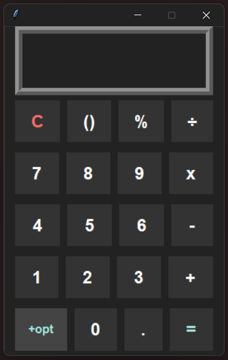

# Calculadora
Programa de desktop desenvolvido em Python com interface gráfica Tkinter, inspirada no design minimalista.

## Interface

## Funcionalidades
Design Moderno: Interface limpa com transições suaves de hover.

Dois Modos de Operação: Alterne facilmente entre o teclado numérico padrão e o Modo Científico.

Suporte Completo ao Teclado: Digite números, use operadores, limpe a tela (C) ou alterne modos diretamente pelas teclas de atalho.

Operações Avançadas: Funções trigonométricas (sin, cos, tan), logaritmos (log, ln), raízes (√), potências e tratamento inteligente de porcentagem (%).