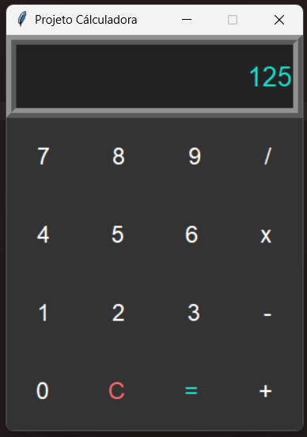

# Calculadora
Programa de desktop desenvolvido em Python.

## Interface

## Implementações
As teclas podem ser acessadas tanto pelo mouse quanto pela tecla. Operações irreais são tratadas como erro.